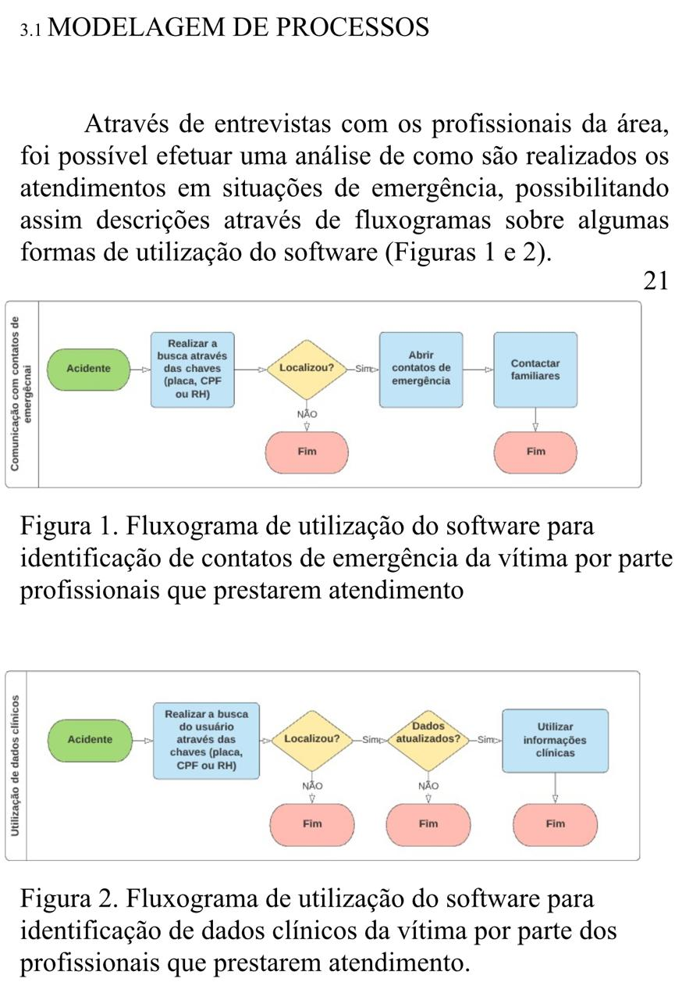
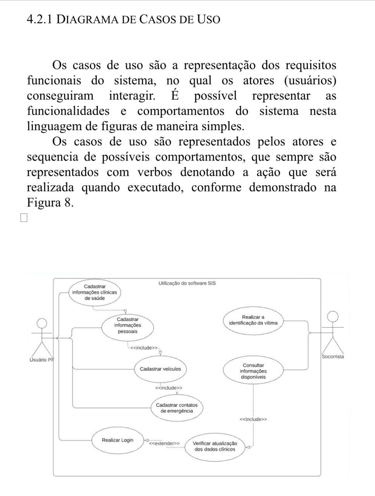
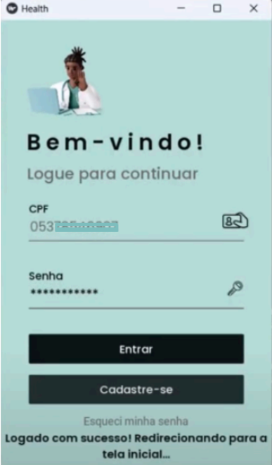
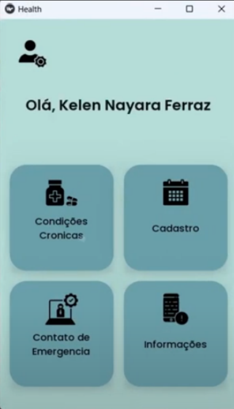
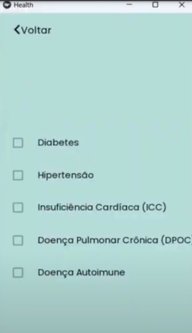
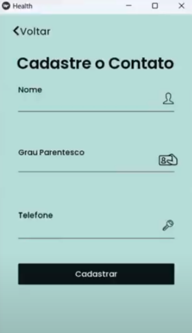
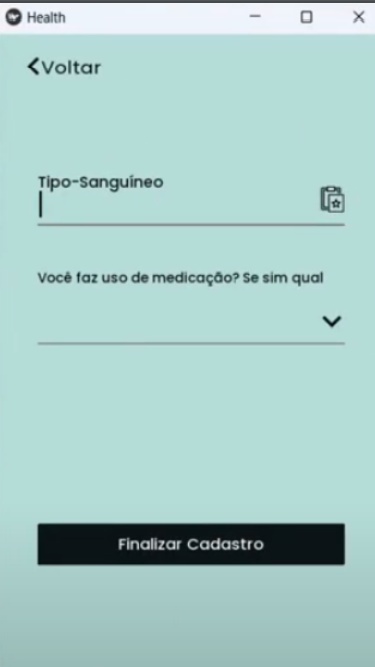
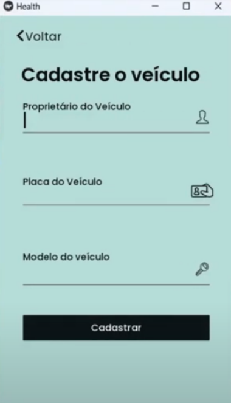
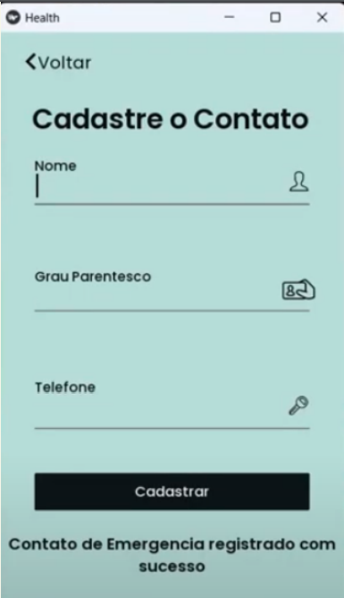

Com a expansão dos centros urbanos, tornou-se rotina a visualização de acidentes distribuídos pela cidade. Felizmente, grande parte dos acontecimentos são casos leves. Contudo, diariamente o sistema público é acionado para prestar atendimento para essas situações.

No ano de 2023, dados divulgados pelo **DETRAN PR** demonstram o aumento de veículos por habitantes no estado do **Paraná**, chegando à estatística de **68 veículos a cada 100 habitantes**. Devido a isso, a importância de informações clínicas básicas sobre uma vítima e a possibilidade de contato rápido com os familiares torna-se um produto valioso na mão daqueles que precisam prestar um primeiro atendimento. Informações como:

- **Medicamentos em uso**
- **Alergias presentes**
- **Tipo sanguíneo**
- **Comorbidades**

Vinculadas à confiabilidade de atualizações periódicas, poderiam ser utilizadas por um socorrista para um atendimento mais assertivo e também para a comunicação com familiares para obtenção de informações cruciais entre ambas as partes.

<a href="https://github.com/KelenX/Emergency---Connect" style="display: inline-block; padding: 10px 20px; font-size: 16px; color: white; background-color: #007bff; border-radius: 5px; text-decoration: none;">Repositório do aplicativo</a>

<a href="https://www.google.com" style="display: inline-block; padding: 10px 20px; font-size: 16px; color: white; background-color: #007bff; border-radius: 5px; text-decoration: none;">Projeto</a>

